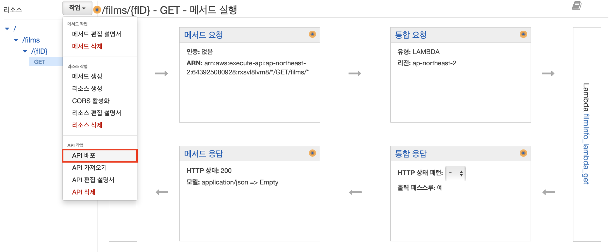
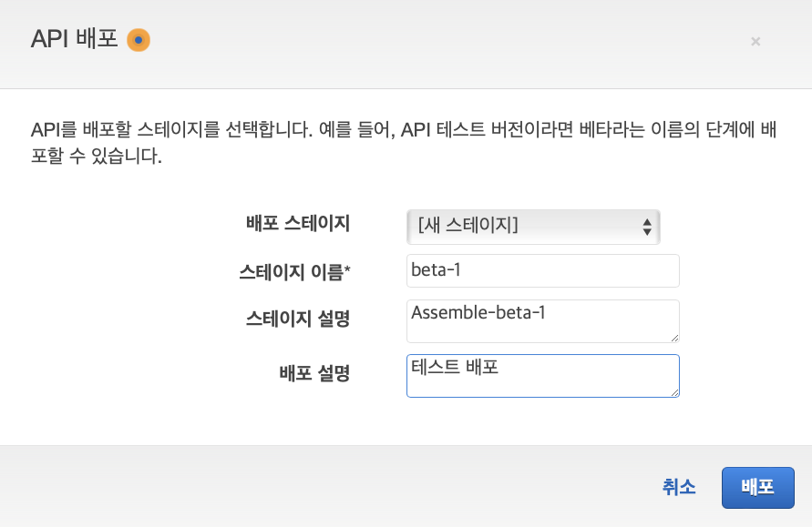
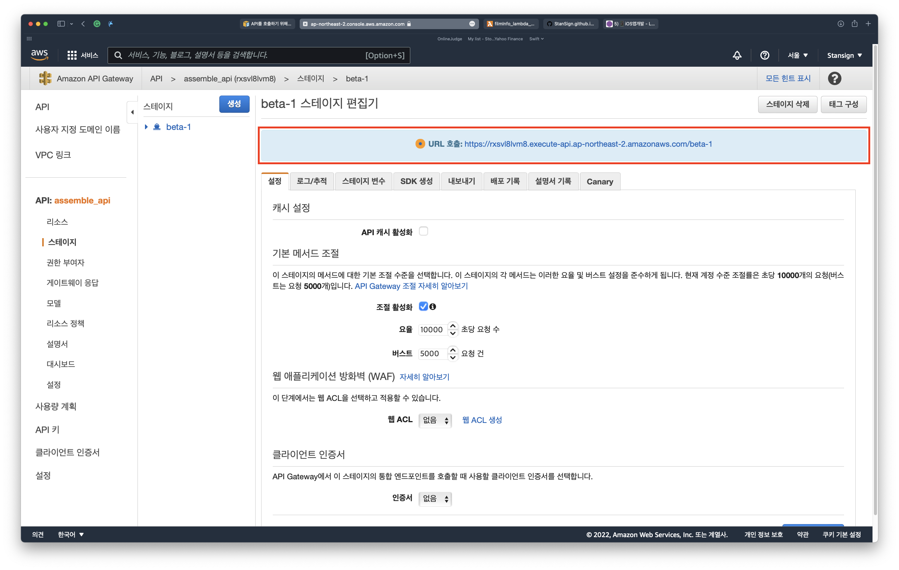
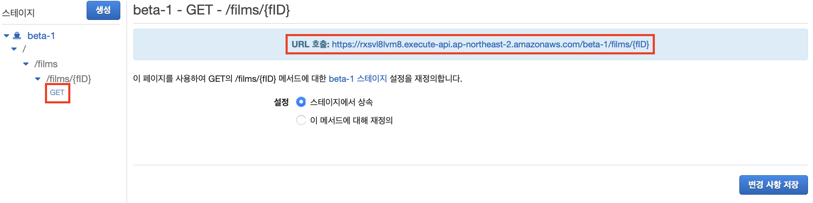
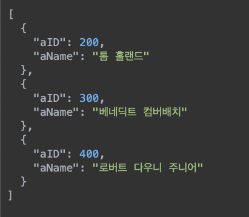

### 함수를 테스트할 로컬 환경 만들기

완성된 함수를 아마존 서버에 올리고 싶어서 로컬에서 먼저 테스트하기 위한 환경을 만들어주겠습니다. 파이썬을 사용해서 MySQL에 접근해야하기 때문에 먼저 PyMySQL이라는 라이브러리를 설치해야 합니다. 아래 명령어로 설치해줍니다. (맥 환경)

```
$ pip install PyMySQL
```

이제 테스트 코드를 작성해보겠습니다.

```
import pymysql as mysql
import pandas as pd

db = mysql.connect(
    host='본인의 RDS 엔드포인트', 
    user='RDS username', 
    password='RDS password', 
    db='본인의 DB 이름', 
    charset='utf8'
)

try:
    with db.cursor(mysql.cursors.DictCursor) as cursor:
        sql = "SELECT * FROM actor"
        cursor.execute(sql)
        result = cursor.fetchall()

        result = pd.DataFrame(result)
        print(result)
finally:
    db.close()
```

#### DB 연결 - connect()
```
db = mysql.connect(
    host='본인의 RDS 엔드포인트', 
    user='RDS username', 
    password='RDS password', 
    db='본인의 DB 이름', 
    charset='utf8'
)
```
connect() 함수를 통해 RDS의 DB에 직접적으로 연결할 수 있습니다. 
* host: RDS 엔드포인트
* user: 설정한 RDS username
* password: 설정한 RDS password
* db: RDS DB 이름
* charset: 문자 인코더

#### 커서 사용 - cursor()
```
db.cursor(mysql.cursors.DictCursor) as cursor
```
PyMySQL에서는 커서를 사용해 DB에 접근할 수 있습니다. 파이썬 작업 중에도 가시성이 좋은 출력 결과를 얻고 싶어 데이터프레임 형태로 출력하기로 했습니다. 이를 위해 Dictionary 형태로 결과를 내보내는 **DictCursor**를  사용하였습니다.

#### 데이터 접근 - execute()
```
sql = "SELECT * FROM actor"
cursor.execute(sql)
result = cursor.fetchall()
```

**execute()** 함수의 파라미터로 쿼리문을 넣어 SQL을 실행하고 **fetch 함수**를 사용해 결과를 받아올 수 있습니다. fetch 함수에도 여러 종류가 있는데 다음과 같습니다.
* **fetchall()**: 모든 데이터를 한 번에 fetch
* **fetchone()**: 하나의 행만 fetch
* **fetchmany(n)**: n개의 데이터를 fetch

#### 결과를 데이터프레임으로 출력
```
result = pd.DataFrame(result)
print(result)
```
**pandas** 라이브러리를 사용해 결과를 데이터프레임의 형태로 출력해줍니다.

#### 데이터 적용 - commit()

**INSERT, UPDATE, DELETE**문은 DB에 변경이 생기게 되므로 **commit** 과정이 필요합니다. 저의 예시에서는 SELECT만 사용하여 commit을 하지 않았지만 이 외의 경우에는 매우 중요합니다.
```
db.commit()
```

##### 결과


#### Placeholder
sql문을 작성할 때 **placeholder**를 사용해 데이터를 동적으로 다룰 수 있습니다.
```
data = ('케빈 파이기', 500000000)
# data = [['케빈 파이기', 1536253195], ['에이미 파스칼', 1536253195], ['제임스 건', 167400219]]

sql = "SELECT * FROM filmInfo WHERE fDirector = %s AND fBoxOffice > %s"
execute(sql, data)
executemany(sql, multiple data)
```
두 번째 파라미터에 들어간 data들이 작성된 순서대로 실행되어 반복문과 같은 동작을 하게 됩니다. 

### Lambda에 함수 적용하기

이제 AWS 서버에 전의 과정을 통해 만들어진 함수들을 업로드해보겠습니다. 우선 이 함수에서 사용된 라이브러리들이 서버에는 없기 때문에 우리가 직접 제공해줘야 합니다. 아래 명령어를 통해 라이브러리를 원하는 디렉토리에 다운로드 받습니다.
```
$ pip install PyMySQL -t .
```

그리고 위의 함수에서 DB의 정보에 대한 부분을 dbinfo.py 파일에 따로 분리해주겠습니다.
```
db_host='본인의 RDS 엔드포인트'
db_user='RDS username'
db_password='RDS password'
db_name='본인의 DB 이름'
db_charset='utf8'
db_port=3306 # RDS default
```
원래 함수의 DB 정보 부분도 수정해줍니다.
```
import dbinfo

db = mysql.connect(
    host=dbinfo.db_host, 
    user=dbinfo.db_user, 
    password=dbinfo.db_password, 
    db=dbinfo.db_name, 
    charset=dbinfo.db_charset
)
```

마지막으로 테스트를 위해 사용했던 pandas 라이브러리를 사용하지 않게 바꾸어줍니다.
```
result = pd.DataFrame(result)
print(result)
```

```
for result in results:
    print(result)
```
위 코드를 아래 코드와 같이 바꿔주고, pandas를 import한 부분도 삭제해줍니다.

최종적으로 얻은 이 네가지 파일과 폴더를 zip파일로 압축해줍니다. 이 압축 파일을 lambda 함수에 업로드 해야합니다.

우측 상단에서 업로드를 진행하면, 

이렇게 lambda 함수의 내용이 압축 파일의 내용으로 교체됩니다.


마지막으로 코드 하단에 있는 **런타임 설정 > 편집**에서 핸들러를 **실행할 파일 이름.그 코드에서 실행할 함수 이름**으로 바꿔주고 저장합니다.

이제 이 코드를 Test 해보겠습니다. Test 버튼을 누르고, 

이벤트 이름을 정해주고, 제 코드는 파라미터가 필요없으므로 공란으로 두고 생성해줍니다. 다음부터는 이벤트 템플릿에 저장된 테스트 이벤트를 선택해서 사용해줄 수 있습니다.

이렇게 결과가 정상적으로 출력되었다면 성공입니다!

### API 배포

이렇게 만들어진 API를 배포해보겠습니다. API Gateway로 돌아와서 API 배포를 해줍니다.



스테이지 편집기의 상단에 API 호출 주소가 표시됩니다.


왼쪽에서 이전에 만든 주소를 찾아 들어가면 해당 주소의 API 호출 주소도 볼 수 있습니다.


이 주소로 접속해보면 현재는 null이 뜨는 것이 정상입니다. Lambda 함수에서 아무것도 return 해주지 않았기 때문이죠. API 주소가 제대로 작동하는 것을 확인했으니 이제 정말로 return 값도 만들어줍시다. Lambda 서비스로 돌아가 코드를 수정해줍니다. 저는 list를 만들어 결과들을 append 해준 뒤 return 해주었습니다.

```
import dbinfo
import pymysql as mysql

db = mysql.connect(
    host=dbinfo.db_host, 
    user=dbinfo.db_user, 
    password=dbinfo.db_password, 
    db=dbinfo.db_name, 
    charset=dbinfo.db_charset)

def lambda_handler(event, context):
    result_list = []
    try:
        with db.cursor(mysql.cursors.DictCursor) as cursor:
            sql = "SELECT * FROM actor"
            cursor.execute(sql)
            results = cursor.fetchall()
    
            for result in results:
                print(result)
                result_list.append(result)
    finally:
        return result_list
```

이제 다시 API 호출 주소로 접속해보면?


이렇게 결과값이 나오면 API 생성에 성공한 것입니다!