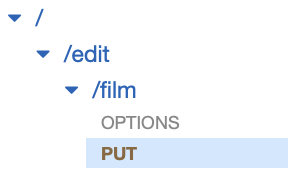

DB 틀이 어느정도 맞춰졌으니 실제로 데이터를 넣어보려고 합니다. 이전에 만들어두었던 Lambda 함수와 API Gateway를 사용하면 RESTful하게 데이터를 입력해줄 수 있습니다.

### API Gateway

위와 같이 리소스를 생성해주고 PUT 메서드를 추가해주었습니다. API Gateway에서 지원하는 메서드는 총 6가지인데, HTTP 메서드와 동일한 역할을 합니다.
#### HTTP Method

##### 1. ANY
아래 다섯 메서드 중 적합한 메서드를 골라 실행한다.
##### 2. GET
데이터를 조회/검색할 때 사용된다. 요청시에 body 값과 content-type 없이 url에 파라미터만 입력하여 사용된다. 요청이 성공적으로 완료되면 200(OK) 메시지와 함께 body 값에 데이터가 저장되어 돌아온다.
~~~
GET /films/2024012802
~~~
##### 3. POST
새로운 데이터를 생성할 때 사용된다. 요청시에 body 값과 content-type을 필요로 하고, 생성할때만 사용되기 때문에 이미 중복된 데이터가 있더라도 무조건 생성을 시도한다. url에 모든 데이터를 넣는 것은 너무나 불편하기 때문에 body에 데이터를 넣어 보낸다. 성공적으로 데이터를 생성하면 201(created) 메시지와 함께 body 값에 생성된 값이 저장되어 돌아온다.
~~~
POST /films
body: {fID: 2023042403, fNM: "영화" ... }
content-type: "application/json"
~~~
##### 4. PUT
데이터를 업데이트/생성할 때 사용된다. POST와 비슷하지만 이미 존재하는 데이터에 대해서는 업데이트가 이루어진다. (idempotent)
~~~
PUT /films/2023042403
body: {fNM: "영화2" ... }
content-type: "application/json"
~~~
##### 5. DELETE
존재하는 데이터를 삭제할 때 사용된다. GET과 비슷하게 url을 통해서 삭제할 데이터를 파라미터로 받는다. 성공적으로 데이터가 삭제되면 별도의 body 내용 없이 성공 응답만 돌아온다.
~~~
DELETE /films/2023042403
~~~