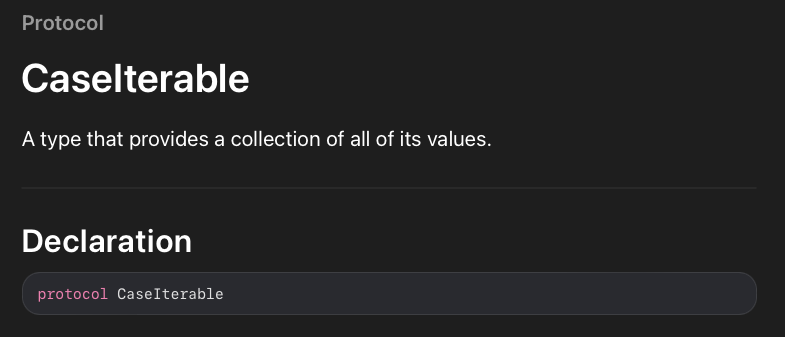

Pageboy 라이브러리의 예제를 보던 도중 **CaseIterable** 프로토콜을 사용하는 예제가 있는데 이게 뭔지를 몰라서 공부를 해보았습니다.

CaseIterable 프로토콜은 모든 case들에 대해 컬렉션을 만들어 제공해주는 타입입니다. 쉽게 말해서 enum 열거형의 각 case에 배열처럼 접근할 수 있다는 말입니다. 또 더 쉽게 말하면, enum 열거형 타입에 forEach와 같은 루프등을 쓸 수 있게 됩니다.

~~~
enum Tab: String, CaseIterable {
    case detail
    case front
    case board
}
~~~

위 예제를 보면 Tab이라는 enum 열거형 변수가 있습니다. 우선 String 타입을 갖는 enum이기 때문에 각 case의 이름과 동일한 Raw Value가 각각 지정됩니다. 

그리고 오늘 다루는 CaseIterable 프로토콜 또한 채택되어 있습니다. 덕분에 우리는 Tab이라는 값에 **"allCases"** 프로퍼티를 사용해 **배열처럼 접근**할 수 있습니다. 나아가서는 배열이기에 **고차함수**(map, reduce, filter, ...) 또한 사용할 수 있습니다. 

~~~
private let tabItems = Tab.allCases.map({ BarItem(for: $0) })
~~~

위 예제를 보면 Tab이라는 enum 타입에 map을 사용하여 BarItem 클래스의 규칙에 따라 변환된 각 case들을 tabItems에 저장하였습니다. 